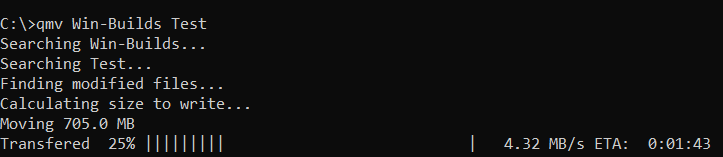

# Quick Move
* [General](#general)
* [Usage](#usage)
* [Setup](#setup)

---
### General
* This uses python >=3.6
* Will compare by hashing files and if they are different, then it will be transfered

---
### Setup
* Easy setup, `python setup.py install`

### Usage
Currently this only takes a source folder or file and a destination.
* `qmv src dest`
